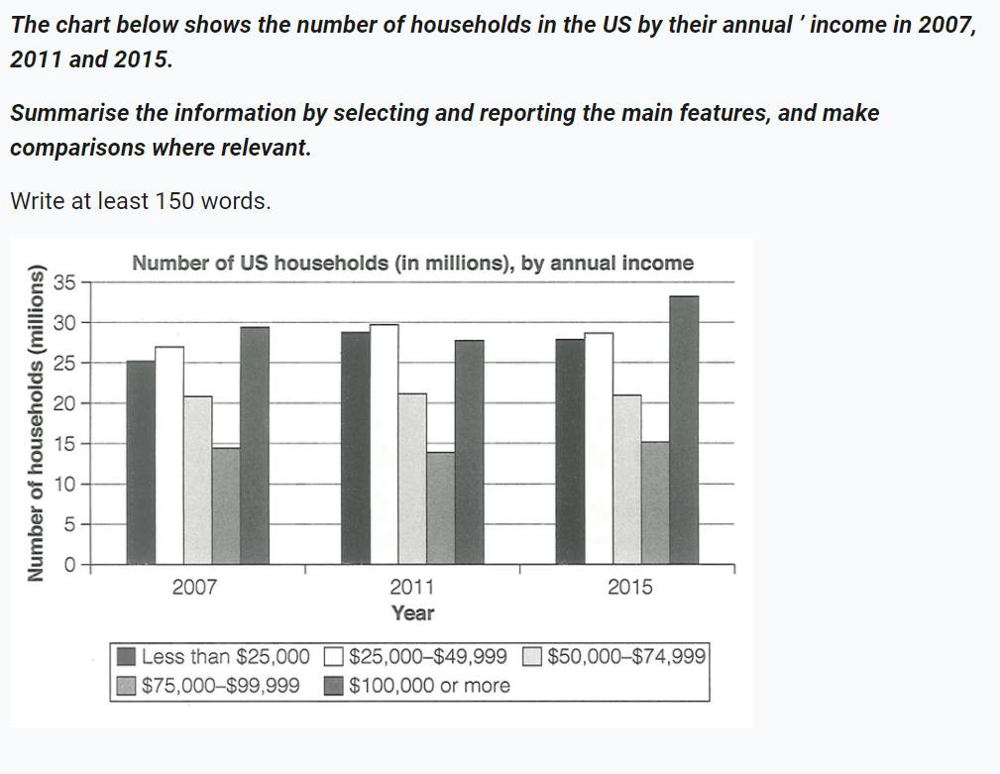
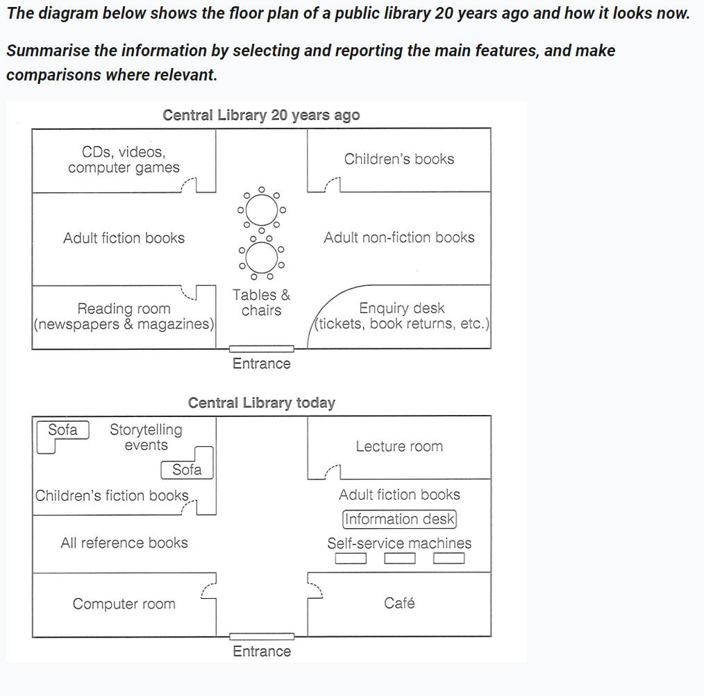
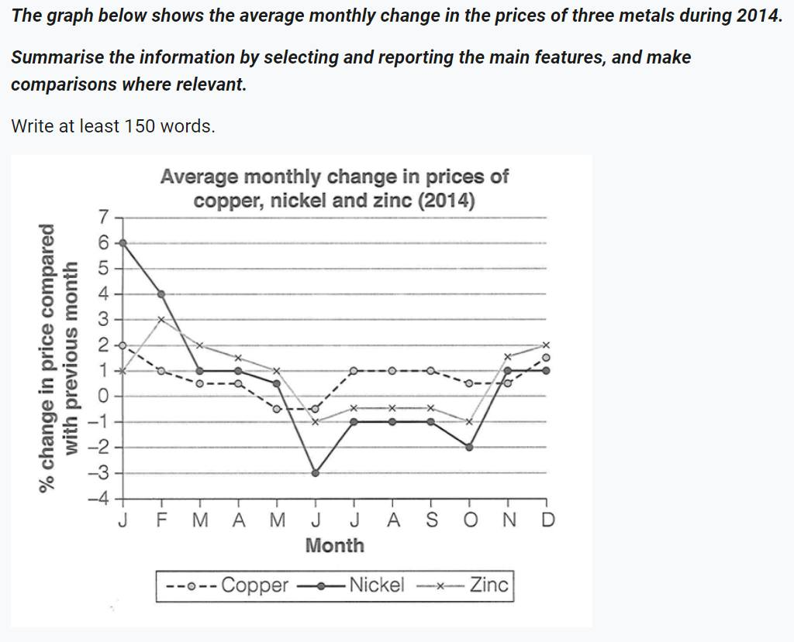
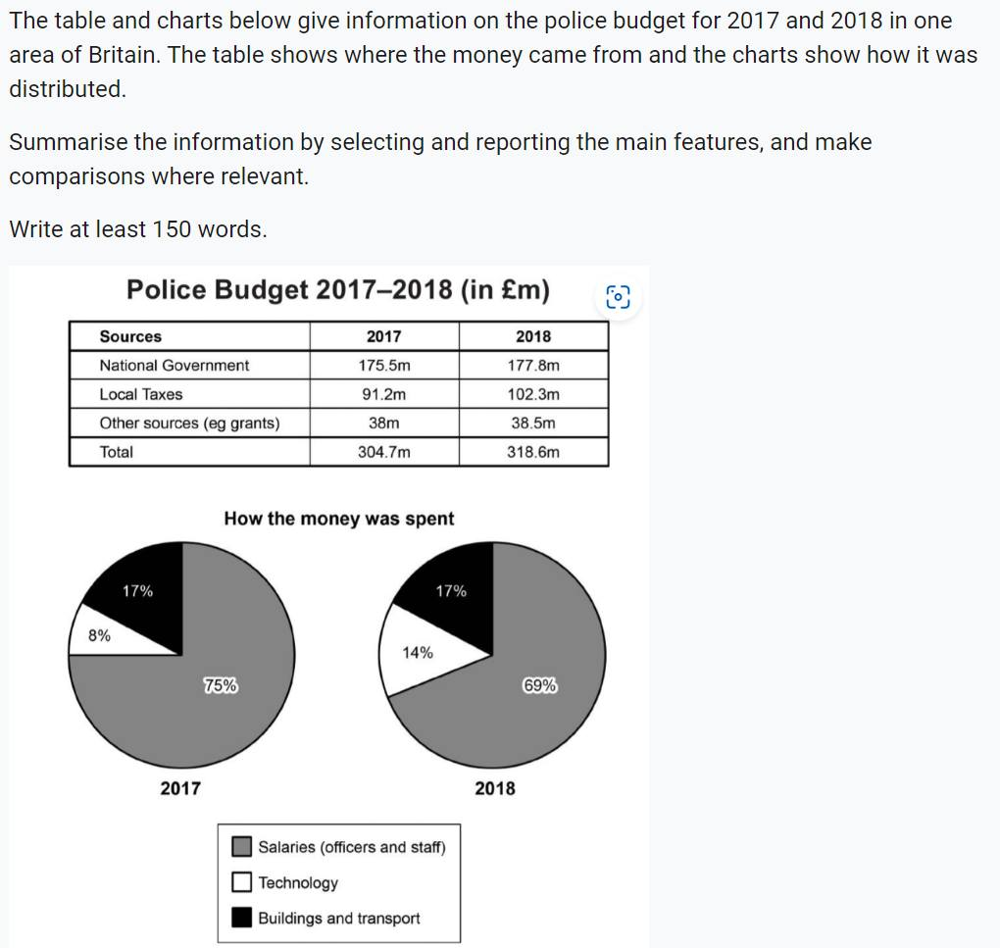
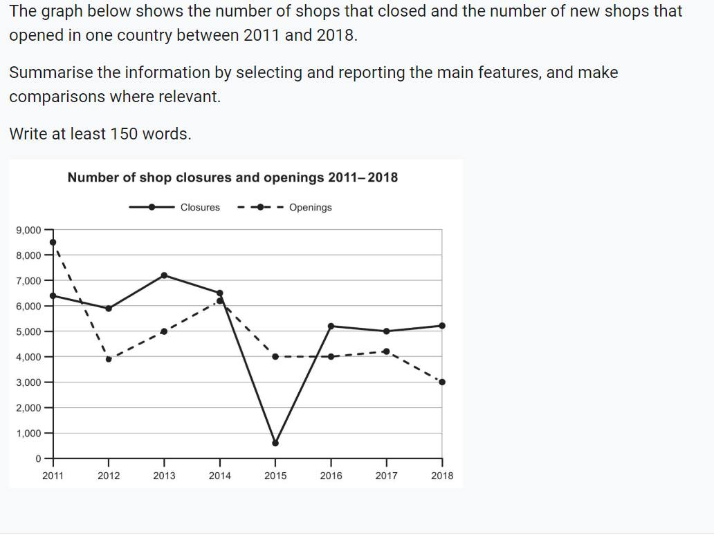

## Cambridge IELTS Vol 18
### Practice Test 1

Analysis:
1. What kind of chart/graph is this?
2. What is the information?
3. How is this information measured?
4. Is there a time period?

My own response:
<blockquote>
The given line graph highlights how the percentage of the population residing in cities in four different Asian countries - the Philippines, Malaysia, Thailand, and Indonesia - changes for a period of 70 years from 1970 to 2020. The most notable observation from this graph is the increase in the number of city dwellers among these four countries.
</blockquote>

### Practice Test 2

My own response:
<blockquote>
The bar graph presents the number of families in the US, categorized by their annual earnings, in three different years: 2007, 2011, and 2015. The data, measured in millions, is divided into five categories. Several trends can be observed from the graph. Firstly, there is a general increase in the earnings of both upper-class and lower-class families, with earnings greater than or equal to $100,000 and less than $25,000 respectively. In contrast, the earnings of middle-class families, with incomes ranging from $25,000 to $99,999, remained relatively unchanged.
</blockquote>

### Practice Test 3

My own response:
<blockquote>
The diagram details the floor plan of a central library in the present day compared to twenty years ago. The most significant fact to emerge from the diagram is that the library has a more open layout and there is greater emphasis on technology, self-service, and recreation. All rooms have been reorganized and only the entrance is unchanged.
</blockquote>

### Practice Test 4

My own response:
<blockquote>
The line chart illustrates the changes in monthly prices of three metals - copper, nickel, and zinc - over the course of 2014. Overall, there were declines for the prices of copper and especially nickel, and a moderate rise for zinc. By the end of the period, the changes had become less extreme and nickel clearly experienced the greatest month-to-month volatility. 
</blockquote>

## Cambridge IELTS Vol 17
### Practice Test 1

My own response:
<blockquote>
The maps detail an industrial area in Norbiton in the present day and plans for future development. Overall, the town will become less industrial and more residential with the construction of facilities for housing, education, shopping, and medical care. This development will occur primarily to the west and north with only a small patch of farmland remaining undisturbed.
</blockquote>

### Practice Test 2

My own response:
<blockquote>
The table details the sources of funding for the police and the pie charts show the distribution of this budget in a particular region of Britain. Looking from an overall perspective, it is readily apparent that the contributions of all sources increased, though local taxes displayed the greatest funding growth. In terms of expenditure, there was a notable increase in technology funding; meanwhile, buildings and transport was unchanged, and salaries declined though this category continued to commensurate the greatest proportion.
</blockquote>

### Practice Test 3

My own response:
<blockquote>
The bar graph illustrates the percentage of weekly income families in a particular country would allocate for in the years 1968 and 2018. Looking from an overall perspective, it is readily apparent that while spending for food, fuel and power, clothing and footwear, and personal goods declined, the inverse was true for the remaining categories, with only household goods unchanged.
</blockquote>

### Practice Test 4

My own response:
<blockquote>
The line graph details shop closures and openings measured in thousands in a particular nation over the period of eight years from 2011 to 2018. Overall,  it is readily apparent that both figures were in decline, though most noticeably the number of openings. After erratic trends for both categories, by the end of the period closures had become more common.
</blockquote>
